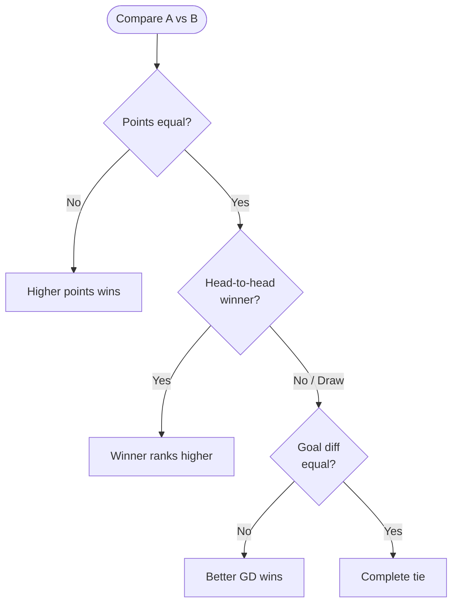

# Standings Ranking Algorithm — St Mark Lions Cup

## Ranking Priority

| # | Criterion | Applied when |
|:---:|---|---|
| 1 | **Points** (`W×3 + D`) | Always — most important |
| 2 | **Head-to-Head** | Points are equal |
| 3 | **Goal Difference** (`GF − GA`) | Points AND head-to-head are equal |

---

## How It Works

The algorithm runs in two phases every time a match is added or deleted.

### Phase 1 — Build Stats

Loop through every recorded match and accumulate stats for both teams:

```js
globalMatches.forEach(m => {
  const home = stats[m.homeTeamId];
  const away = stats[m.awayTeamId];

  home.mp++; away.mp++;
  home.gf += m.homeGoals;  home.ga += m.awayGoals;
  away.gf += m.awayGoals;  away.ga += m.homeGoals;

  if      (m.homeGoals > m.awayGoals) { home.w++; away.l++; }
  else if (m.homeGoals < m.awayGoals) { away.w++; home.l++; }
  else                                 { home.d++; away.d++; }
});

// After the loop, derive GD and PTS
stats[id].gd  = gf - ga;
stats[id].pts = w * 3 + d;
```

### Phase 2 — Sort

`.sort()` calls a **comparator** for every pair of teams `(a, b)`. The comparator returns:
- **Negative** → `a` ranks higher
- **Zero** → equal, move to next gate
- **Positive** → `b` ranks higher

```js
.sort((a, b) => {
  if (b.pts !== a.pts) return b.pts - a.pts;   // Gate 1: Points
  const h2h = headToHead(a.id, b.id);
  if (h2h !== 0)       return h2h;             // Gate 2: Head-to-head
  return b.gd - a.gd;                          // Gate 3: Goal difference
});
```

Each gate **exits immediately** if it produces a result — the next gate is only reached if the current one returns `0`.

---

## The `headToHead(teamAId, teamBId)` Function

```js
function headToHead(teamAId, teamBId) {
  // 1. Find only matches between these two specific teams
  const matches = globalMatches.filter(m =>
    (m.homeTeamId === teamAId && m.awayTeamId === teamBId) ||
    (m.homeTeamId === teamBId && m.awayTeamId === teamAId)
  );

  // 2. Count wins for each side
  let aWins = 0, bWins = 0;
  matches.forEach(m => {
    if (m.homeTeamId === teamAId) {
      if (m.homeGoals > m.awayGoals) aWins++;
      else if (m.homeGoals < m.awayGoals) bWins++;
    } else {
      if (m.awayGoals > m.homeGoals) aWins++;
      else if (m.awayGoals < m.homeGoals) bWins++;
    }
  });

  // 3. Return: negative = A ranks higher, positive = B ranks higher, 0 = tie
  return bWins - aWins;
}
```

**Return value meaning:**

| `bWins - aWins` | Result |
|:---:|---|
| Negative | Team A won more direct matches → A ranks higher |
| `0` | Draw or never played → fall through to Goal Difference |
| Positive | Team B won more direct matches → B ranks higher |

---

## Decision Flowchart



---

## Simulation Example

**4 teams, 6 matches played:**

| Match | Score | Winner |
|---|:---:|---|
| Alpha vs Delta | 3–0 | Alpha |
| Beta vs Delta | 2–0 | Beta |
| Gamma vs Delta | 1–0 | Gamma |
| Alpha vs Beta | 1–2 | Beta |
| Alpha vs Gamma | 2–2 | Draw |
| Beta vs Gamma | 1–1 | Draw |

**Final stats:**

| Team  |  W  |  D  |  L  | GF  | GA  |   GD   |  PTS  |
| ----- | :-: | :-: | :-: | :-: | :-: | :----: | :---: |
| Beta  |  2  |  1  |  0  |  5  |  1  | **+4** | **7** |
| Gamma |  1  |  2  |  0  |  4  |  3  | **+1** | **5** |
| Alpha |  1  |  1  |  1  |  6  |  4  | **+2** | **4** |
| Delta |  0  |  0  |  3  |  0  |  6  | **−6** | **0** |

All teams separated by points → **Gate 1 decides everything.**

---

### Tiebreaker Example — Gate 2 (Head-to-Head)

> Alpha = 7 pts, Gamma = 7 pts. Their match: **Gamma beat Alpha 2–1**.

```
Gate 1: 7 = 7 → equal → Gate 2
Gate 2: headToHead(Alpha, Gamma)
        aWins=0, bWins=1 → return 1-0 = +1 (positive → Gamma first)
✅ Gamma is 1st. Gate 3 never runs.
```

### Tiebreaker Example — Gate 3 (Goal Difference)

> Alpha = 7 pts, Gamma = 7 pts. Their match was a **draw (2–2)**.
> Alpha GD = **+4**, Gamma GD = **+2**.

```
Gate 1: 7 = 7 → equal → Gate 2
Gate 2: headToHead → aWins=0, bWins=0 → returns 0 → Gate 3
Gate 3: b.gd - a.gd = 2 - 4 = -2 (negative → Alpha first)
✅ Alpha is 1st.
```

---

## Where Is This Code?

`computeStandings()` in [`app.js`](./app.js) — lines 187–240.
